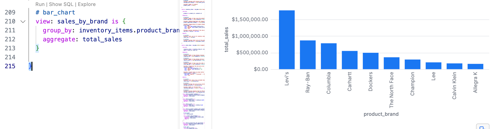
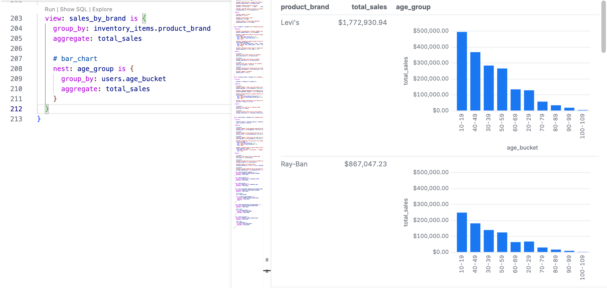
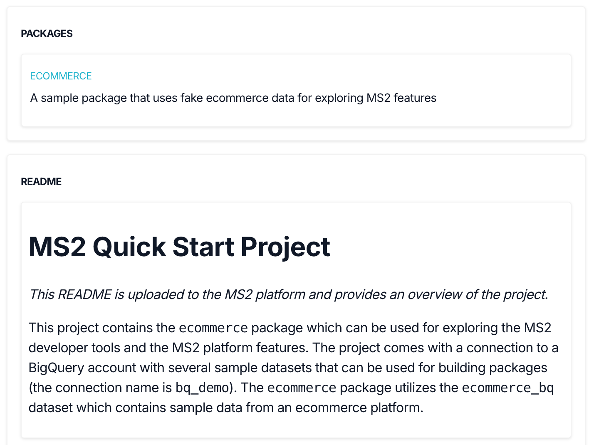

# MS2 Quick Start

Welcome to **MS2**, your AI-powered, open-source-friendly semantic data platform. MS2 helps you transform raw operational data into clean, governed, and reusable semantic models — and then puts those models to work across a wide range of modern data experiences.

At the core of MS2 is [**Malloy**](https://malloydata.dev), an open-source semantic modeling language designed for composability, auditability, and clarity. Malloy models are portable and can run anywhere — and MS2 extends this philosophy with an open, API-driven runtime based on the open-source **Malloy Publisher**. That means no vendor lock-in: you can build locally, host on your own infrastructure, or use our managed service — the choice is yours.

In this Quick Start, you’ll follow a familiar and powerful flow: a **data modeler** defines trusted business logic in VS Code using our AI Copilot, and a **data analyst** explores and extends those definitions using Malloy’s no-code Explorer query builder. This mirrors the proven modeler → analyst workflow popularized by tools like Looker — now reimagined for the AI era, and freed from closed systems.

But this is just the beginning.

Once your semantic model is published, the MS2 platform makes it usable everywhere — powering:
- **Natural language notebooks** for ad hoc exploration
- **AI agents** with contextual, trusted data
- **Embedded data apps** built with our React SDK
- **BI dashboards** through our SQL interface


No matter how your team works — in notebooks, apps, dashboards, or chat — MS2 ensures you’re always working from the same semantic foundation, built on open standards and ready for the future.

---

<br>

# Semantic Modeling Workflow

MS2 helps you create, govern, and use semantic models of your business data — quickly and at scale. In this section, you’ll:

1. Build a semantic model using the MS2 AI Copilot
2. Analyze data using Malloy notebooks
3. Publish your models and analyses to the MS2 service

## Step 1: Build a Semantic Model with AI Copilot

At the core of MS2 is the **semantic model**—a governed, versioned interface that defines how your data should be understood and used. Think of it as a **semantic API**: it captures not just structure, but business meaning. You’ll use the **MS2 AI Copilot in VS Code** to generate your first model using existing catalog metadata, query logs, and the structure of your data warehouse.

### Prerequisites

Before starting, make sure:

- A **MS2 admin has set up your organization** on the service.
- You have a basic understanding of **Malloy**, the semantic modeling language MS2 is built on. [View Malloy Docs →](https://docs.malloydata.dev/documentation/)

### Clone the Quick Start Package

```bash
git clone https://github.com/ms2data/ms2-quick-start.git
cd ms2-quick-start
code .
```

### Install the MS2 VS Code Extension

1. Open VS Code.
2. Go to the Extensions view (`Cmd+Shift+X`).
3. Search for `MS2` and install the extension.
4. _(Temporary)_ Find the installed Malloy extension and select **“Switch to Pre-Release Version.”**

> [!WARNING]
> The VS Code AI Copilot extension mostly works in Cursor, but it hasn't been fully tested—some features may be limited.

### Log In to MS2

1. In the VS Code Explorer sidebar, expand **“MS2 Service.”**
2. Click **“Sign In.”**
3. Click **“+ Add new organization”** and enter the name provided by your MS2 admin.
4. Complete the login flow in your browser (email or Google account).
5. When redirected back to VS Code, select the project: `ms2-quick-start`.

The VS Code Service Panel is where you can view your organization's projects, connections, and packages in the MS2 service. For example:


In the `ms2-quick-start` project, you can see you have access to a "bq_demo" connection. The connection is managed by the MS2 service and is not stored locally, but the MS2 VS code extension will discover it in your project and allow you to use it in your local models -- thus eliminating the need to store database credentials locally. The `ms2-quick-start` project has a single package `ecommerce` and a single version has been published (0.0.0)

You can read about organizations > projects > packages structures in the [MS2 Portal Getting Started Guide →](docs/portal.md)

### Generate Your Semantic Model

1. In the file view within the `ecommerce` folder, create a new file: `ecommerce.malloy` (files that end in `.malloy` are Malloy model files)
2. Open the Command Palette (`Cmd+Shift+P`) and run: **MS2: Suggest Semantic Model**
3. When prompted, enter a high-level prompt.  Typically, you want to identify and start with the main transaction table in your data.  For example, in the ecommerce data, the `orders` table is the main transaction table.  So, you might enter: _Build a model of our orders data_

The ecommerce data set has four tables -- orders_items, users, products, and investory_items.  You should see Malloy sources for each of these tables.  The orders data should have join relationship to the users and investory_items tables.  And the investory_items table should have a join relationship to the products table.

Each source show have as set of dimensions and measures defined -- and annotations describing the different entities and type information (e.g., currency, percent, duration).

For more information on how Malloy dimensions, measures, joins, views, etc. work, see the [Malloy documentation →](https://malloydata.dev/documentation)

> [!NOTE] In this example, we are using the ecommerce data set.  The ecommerce data set is a sample data set that is included with the Malloy samples.  Our copilot only has access to the table schema to generate the model.  In a real-world scenario, you can add more context to the copilot by connecting to or uploading additional metadata such as:
> - SQL logs
> - Catalog metadata
> - Query logs
> - Business glossary

### Review & Adjust

Your generated model is a strong starting point — but real-world accuracy matters. You should review the model and make any necessary adjustments.  You can manually edit `.malloy` files, or if you're still learning Malloy, you can use the MS2 extension to help you. For example, highlight a measure or dimensions and press `Ctrl+Cmd+I` to open the prompt text box at the top of the VS code window.  Give our copilot natural language instructions for how to modify the code, e.g., _make the age dimension an age range string such as 10-19_.

> [!TIP]
> The more accurate and complete your semantic model, the better your downstream analysis and AI performance. Describe your data in detail and use the copilot to help you.

## Step 2: Create a View

Let's create a view to help our analysts explore the orders data.  Inside the orders source below the dimensions and measures, write `view: sales_by_brand ` and wait a second.  The copilot should generate a view with a measure for the total sales by brand similar to the following.  



We can run the query by clicking the "Run" above the view.  You should see the results in the "Results" panel on the right.

Let's try a little more complext query.  Below the total sales aggregate type something like _nest age group_ and wait a second.  The copilot should genreate a nested view with a measure for the total sales by age group.  When you run this query, you should see sales broken down by brand, and within each brand, sales broken down by age group similar to the following:



While this type of model and viewing might look simple, it's very difficult to create in most modern data tools.  For example, clicking on the SQL in the results panel, you will see the SQL that was used to generate the results.  This SQL is not easy to write (especially for an LLM) and is prone to errors.  And if you want to change the query, you have to write the SQL manually.


## Step 3: Publish to the MS2 Service

Publishing makes your semantic model and analysis available across the platform — ready to serve AI agents, applications, dashboards, and notebooks. The MS2 service uses standard software package management conventions to provide data governance and versioning for your semantic models and notebooks.

For publishing, we will use the MS2 extension's "Local Packages" panel. The Local Packages panel is where you can view and manage the local packages in your workspace. For example:


If you have the `ecommerce` package open locally, you should see a single version `0.0.0`. This is the version in the package's local `publisher.json` file. `publisher.json` is a file package manifest file that contains the package's name, version, description, and other metadata. To publish a new version of the package, we will need to update the version in the `publisher.json` file.

### Update the Package Version

1. Open the `publisher.json` file in your workspace.
2. Set the version to `0.0.1`:

```json
{
  "name": "ecommerce",
  "version": "0.0.1",
  ...
}
```

### Publish from VS Code

1. In the Explorer panel, expand **“MS2 Local Packages.”**
2. You should see the package `ecommerce`.
3. Click the **“Publish”** button.
4. When prompted, click **“Yes”** to confirm.

> [!NOTE]
> You can also publish packages from the command line using the [MS2 CLI →](docs/cli.md)

### Confirm Successful Publication

1. In the Explorer panel, expand **“MS2 Service.”**
2. Click the **Refresh** icon (🔄).
3. Expand: `Packages` > `ecommerce`
4. You should now see version `0.0.1` listed under the package.

### Voila!

Your semantic model is now:

- **Governed** and version controlled
- **Discoverable** and queryable via APIs and notebooks
- **Ready** for use by analaysts, embedded apps, dashboards, or AI agents

---

<br>

# Explore your Semantic Model

Now that you've published your semantic model to the MS2 platform, let’s explore and extend it — using Malloy’s **Publisher + Explorer** no-code interface.

This is where your work as a data modeler becomes a launchpad for analysts, product managers, and other data consumers to ask meaningful questions — without writing a single line of SQL.

## Open Publisher + Explorer

1. Open your browser, go to, and login:  
   `https://<your-org>.data.ms2.co/ms2-quick-start`

2. You should see a screen with a single package:  
   **`ecommerce`** — the one you just created and pushed.

   

3. Click the package to open it. You’ll land on a screen with three panels: **Package Config**, **Notebooks**, and **Models**.

   

4. In the **Models** panel, you should see the `ecommerce.malloy` file you authored in VS Code.  
   Click it. This will open the **Explorer** — your visual, no-code query builder.


## Understand the Explorer Layout

The Explorer interface has three panels:

- **Source Panel (Left)**: Browse your semantic model — dimensions, measures, views — grouped by source.
- **Query Panel (Middle)**: Construct and refine your queries.
- **Results Panel (Right)**: See your live results and inspect the generated Malloy or SQL.

At the top, you’ll see your available sources — `order_items`, `users`, `products`, `inventory_items` — created earlier in your Malloy model.  Note that some of the source, dimension, and measure names in this quick start guide may be different from the names in your model.


Let’s walk through a real example.

## Load and Run a Saved View

1. Click on the `order_items` source tab.
2. In the **Views** section of the Source Panel, you should see the `revenue_by_brand` view you created in VS Code.
3. Click it. The Query Panel should populate with your saved query.
4. Click **Run**.


✅ You should see the exact same result in the Results Panel that you saw earlier in VS Code.


## Recreate the Revenue by Brand Nested Query in Explorer

Now let’s recreate that same query — from scratch — using just clicks.

1. In the Query Panel, click **Clear** to start fresh.
2. In the Source Panel:
   - Open dimensions and scroll down to the products source. You'll see products is joined with order_items, which allows us to group by brand. Expand the `products` source.
   - Hover over `brand` and select **Add as Group By**.
   - Open Measures and scroll down to the `total_sales` measure in the `order_items` source.
   - Hover over `total_sales` and select **Add as Aggregate**.

3. The Query Panel now shows these fields.  
   Click **Run** — and you'll see revenue by brand in the Results Panel.

   

4. Now, click the **+** button at the top of the Main Query panel and select **Add blank nested query**.

5. In the nested query block that appears, click the **+** button inside of thest nested query and:
   - Add a Group By and select `user_age_group`
   - Add an Aggregate and select `total_sales` 
   - Click **Run**.

   

✅ You’ve just created a **nested query** that breaks down sales by brand and age group — the same query you wrote earlier in code — now in just a few clicks.

To learn more about the Explorer, see the [Explorer Documentation →](https://github.com/malloydata/publisher/blob/main/docs/explorer.md)

## Reflect on What You Just Did

Let’s pause and appreciate what just happened:

- You **built a semantic model** using Malloy and the MS2 AI Copilot.
- You created a view in **VS Code** with nested logic that most SQL experts would struggle to write.
- Then, using that same model, you **recreated the same analysis in Explorer** with a few clicks — enabling anyone on your team to generate complex insights from a trusted, governed model.

This is the power of MS2:
- Developers and analysts working together, on the same foundation.
- Code and no-code experiences that reinforce each other.
- A single semantic model, used across tools and personas — AI, dashboards, apps, and more.

---

<br>

# Administration

While this Quick Start focused on the core workflow of building and exploring a semantic model, the MS2 platform is a globally distributed system designed to scale with your organization — across environments, teams, and regions.

This gives you:
- **100× the scale**, **10× the availability**, and **1/10th the cost** compared to legacy BI and state of the art semantic layers
- **Enterprise-grade controls** like governed metrics, fine-grained ACLs, versioning, audit logs, and usage telemetry

MS2 provides powerful administration tools to help you manage your semantic resources and deployment workflows with confidence and control.

## MS2 Admin Portal

The **Admin Portal** is a browser-based interface for managing your organization’s semantic models.

🔗 Open the Admin Portal:  
`https://<your-org>.admin.ms2.co/ms2-quick-start`

From the portal, you can:
- Navigate across **organizations**, **projects**, and **packages**
- Manage permissions and access roles
- View and promote package versions
- Configure database connections for different environments (e.g., dev, staging, prod)

To learn more, see the [Admin Portal Guide →](docs/portal.md)

## MS2 CLI

For advanced users and DevOps teams, the **MS2 CLI** offers full control over your semantic layer via the command line — ideal for automation, CI/CD, and scripting.

With the CLI, you can:
- Manage projects, packages, and connections
- Publish and promote versions
- Automate semantic model deployments

To learn more, see the [MS2 CLI Guide →](docs/cli.md)

With MS2’s robust admin tools, you can confidently govern semantic models across environments — and power data experiences at scale.

---

<br>

# Other Data Consumer Experiences

MS2 offers multiple, role-tailored ways to consume your semantic models. Pick the path (or paths) that suit your target roles and goals best — and build from a single source of truth. Click on the options below to continue.

## Embedded Data Apps (React SDK)

👥 **Target Persona:** Software engineers building data driven apps

✅ **Great for:** Building internal tools, customer facing dashboards, or any UI that needs trustworthy data experiences.

[📖 Publisher - Embedded Data Apps →](https://github.com/malloydata/publisher/blob/main/docs/embedded-data-apps.md)

## AI Agents (Model Context Protocol)

👥 **Target Persona:** Analysts and engineers using tools like Claude, Cursor, or custom agents

✅ **Great for:** Trustworthy AI copilots, conversational analytics, and embedded intelligence.

[📖 Publisher - AI Agents →](https://github.com/malloydata/publisher/blob/main/docs/ai-agents.md)

## Legacy Dashboards (SQL Interface)

👥 **Target Persona:** Analysts using Tableau, Power BI, Looker, Superset, Metabase, etc.

✅ **Great for:** Semantic consistency in legacy dashboards, reduced maintenance and duplication of logic, and a bridge from existing BI tools into the semantic layer.

[📖 Legacy - BI Dashboards →](https://github.com/malloydata/publisher/blob/main/docs/legacy-bi.md)

## More Consumer Experiences Coming Soon...

# What’s Next?

Choose the consumption path(s) that match your workflow and:

- Start building semantic powered applications
- Share notebooks with stakeholders
- Connect AI agents to drive smart, explainable automation
- Prepare to unify dashboards via the upcoming SQL interface

