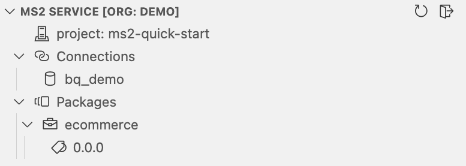
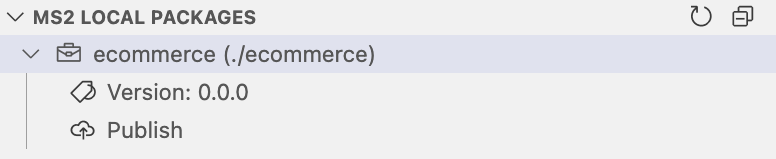

# MS2 Quick Start

Welcome to **MS2**, your AI-powered semantic data platform. MS2 transforms the chaos of raw operational data into clean, governed, and AI-ready semantic models — and then makes those models usable everywhere. Whether you're a developer, analyst, product manager, or AI engineer, you work from the same shared foundation.

## Here’s How it Works

Using our VS Code **AI Copilot**, you generate rich, structured semantic models that define your business concepts, metrics, and relationships with precision. Our AI Copilot uses your operational tables, SQL logs, and catalog metadata to generate rich semantic models quickly and accurately.

From there, your models become the foundation for a variety of trusted data experiences such as --
_Natural Language Notebooks for ad hoc exploration, Embedded Data Apps, AI Agents powered by semantic understanding, and BI Dashboards (via a SQL interface)._


This Quick Start Guide will walk you through building your first semantic model, publishing it, and choosing how you want to put it to work — based on your target roles and your goals.

# Semantic Modeling Workflow

MS2 helps you create, govern, and use semantic models of your business data — quickly and at scale. In this section, you’ll:

1. Build a semantic model using the MS2 AI Copilot
2. Analyze data using Malloy notebooks
3. Publish your models and analyses to the MS2 service

## Step 1: Build a Semantic Model with AI Copilot

At the core of MS2 is the **semantic model**—a governed, versioned interface that defines how your data should be understood and used. Think of it as a **semantic API**: it captures not just structure, but business meaning. You’ll use the **MS2 AI Copilot in VS Code** to generate your first model using existing catalog metadata, query logs, and the structure of your data warehouse.

### Prerequisites

Before starting, make sure:

- A **MS2 admin has set up your organization** on the service.
- You have a basic understanding of **Malloy**, the semantic modeling language MS2 is built on. [View Malloy Docs →](https://malloydata.dev)

### Clone the Quick Start Package

```bash
git clone https://github.com/ms2data/ms2-quick-start.git
cd ms2-quick-start
code .
```

### Install the MS2 VS Code Extension

1. Open VS Code.
2. Go to the Extensions view (`Cmd+Shift+X`).
3. Search for `MS2` and install the extension.
4. _(Temporary)_ Find the installed Malloy extension and select **“Switch to Pre-Release Version.”**

> [!WARNING]
> The VS Code AI Copilot extension mostly works in Cursor, but it hasn't been fully tested—some features may be limited.

### Log In to MS2

1. In the VS Code Explorer sidebar, expand **“MS2 Service.”**
2. Click **“Sign In.”**
3. Click **“+ Add new organization”** and enter the name provided by your MS2 admin.
4. Complete the login flow in your browser (email or Google account).
5. When redirected back to VS Code, select the project: `ms2-quick-start`.

The VS Code Service Panel is where you can view your organization's projects, connections, and packages in the MS2 service. For example:



In the `ms2-quick-start` project, you can see you have access to a "bq_demo" connection. The connection is managed by the MS2 service and is not stored locally, but the MS2 VS code extension will discover it in your project and allow you to use it in your local models -- thus eliminating the need to store database credentials locally. The `ms2-quick-start` project has a single package `ecommerce` and a single version has been published (0.0.0)

You can read about organizations > projects > packages structures in the [MS2 Portal Getting Started Guide →](READMEs/portal.md)

### Generate Your Semantic Model

1. In the file view within the `ecommerce` folder, create a new file: `ecommerce.malloy` (files that end in `.malloy` are Malloy model files)
2. Open the Command Palette (`Cmd+Shift+P`) and run: **MS2: Suggest Semantic Model**
3. When prompted, enter a high-level prompt. For example: _Build a model of ecommerce data that makes it easy to analyze sales trends across different dimensions._

The copilot will generate a Malloy model with:

- Dimensions, measures, joins
- Common views and reusable queries
- Descriptions and documentation

For more information on how Malloy dimensions, measures, joins, views, etc. work, see the [Malloy documentation →](https://malloydata.dev/documentation)

> [!WARNING]
> Please note MS2 is an early-stage product and the copilot is not yet fully optimized. We expect to make substantial improvements to the copilot in the coming months. If any syntax errors remain, fix them manually before proceeding.

### Review & Adjust

Your generated model is a strong starting point — but real-world accuracy matters. You can:

TODO: Flesh this section out with screenshots and more detail.

- Manually edit `.malloy` files
- Accept inline suggestions from the MS2 extension
- Press `Ctrl+Cmd+I` to open the prompt window and generate or modify code with natural language instructions

> [!TIP]
> The more accurate and complete your semantic model, the better your downstream analysis and AI performance. Describe your data in detail and use the copilot to help you.

## Step 3: Publish to the MS2 Service

Publishing makes your semantic model and analysis available across the platform — ready to serve AI agents, applications, dashboards, and notebooks. The MS2 service uses standard software package management conventions to provide data governance and versioning for your semantic models and notebooks.

For publishing, we will use the MS2 extension's "Local Packages" panel. The Local Packages panel is where you can view and manage the local packages in your workspace. For example:



If you have the `ecommerce` package open locally, you should see a single version `0.0.0`. This is the version in the package's local `publisher.json` file. `publisher.json` is a file package manifest file that contains the package's name, version, description, and other metadata. To publish a new version of the package, we will need to update the version in the `publisher.json` file.

### Update the Package Version

1. Open the `publisher.json` file in your workspace.
2. Set the version to `0.0.1`:

```json
{
  "name": "ecommerce",
  "version": "0.0.1",
  ...
}
```

### Publish from VS Code

1. In the Explorer panel, expand **“MS2 Local Packages.”**
2. You should see the package `ecommerce`.
3. Click the **“Publish”** button.
4. When prompted, click **“Yes”** to confirm.

> [!NOTE]
> You can also publish packages from the command line using the [MS2 CLI →](READMEs/cli.md)

### Confirm Successful Publication

1. In the Explorer panel, expand **“MS2 Service.”**
2. Click the **Refresh** icon (🔄).
3. Expand: `Packages` > `ecommerce`
4. You should now see version `0.0.1` listed under the package.

### Voila!

Your semantic model and analysis notebook are now:

- **Governed** and version controlled
- **Discoverable** and queryable via APIs and notebooks
- **Ready** for use by analaysts, embedded apps, dashboards, or AI agents

---

<br>


# Ad Hoc Analysis

Now that your semantic models are published, it’s time to put them to work.

Most data tools are built with a single persona in mind: the analyst, the engineer, or the business user. That leads to fragmented workflows, mismatched definitions, and yet another silo in the stack. **MS2 is different.**

MS2 is a **semantic data platform** — designed to unify how your organization defines, governs, and uses data, across different roles, teams, and tools. We've seen how a data engineer / data modeler can use the MS2 VS Code extension to generate a semantic model and publish it to the MS2 service. Now, we'll see how a business analyst can explore the data in MS2's no-code notebook.

// TODO

👥 **Target Persona:** Business analysts, product managers, less technical users

✅ **Great for:** ad hoc reporting, fast insights, and sharing lightweight dashboards.

[📖 Natural Language Notebooks →](READMEs/nl-notebooks.md)

# Administration

// TODO

- [Explore the MS2 Portal →](READMEs/portal.md)
- [Explore the MS2 CLI →](READMEs/cli.md)


# Other Data Consumer Experiences

MS2 offers multiple, role-tailored ways to consume your semantic models. Pick the path (or paths) that suit your target roles and goals best — and build from a single source of truth. Click on the options below to continue.

## Embedded Data Apps (React SDK)

👥 **Target Persona:** Software engineers building data driven apps

✅ **Great for:** Building internal tools, customer facing dashboards, or any UI that needs trustworthy data experiences.

[📖 Embedded Data Apps →](READMEs/embedded-data-apps.md)

## AI Agents (Model Context Protocol)

👥 **Target Persona:** Analysts and engineers using tools like Claude, Cursor, or custom agents

✅ **Great for:** Trustworthy AI copilots, conversational analytics, and embedded intelligence.

[📖 AI Agents →](READMEs/ai-agents.md)

## Traditional Dashboards (SQL Interface)

👥 **Target Persona:** Analysts using Tableau, Power BI, Looker, Superset, Metabase, etc.

✅ **Great for:** Semantic consistency in legacy dashboards, reduced maintenance and duplication of logic, and a bridge from existing BI tools into the semantic layer.

[📖 Traditional BI Dashboards →](READMEs/traditional-bi.md)

## More Consumer Experiences Coming Soon...

<br>

# What’s Next?

Choose the consumption path(s) that match your workflow and:

- Start building semantic powered applications
- Share notebooks with stakeholders
- Connect AI agents to drive smart, explainable automation
- Prepare to unify dashboards via the upcoming SQL interface

When you're ready to go deeper:
- [Request a Personalized Walkthrough →](#)
