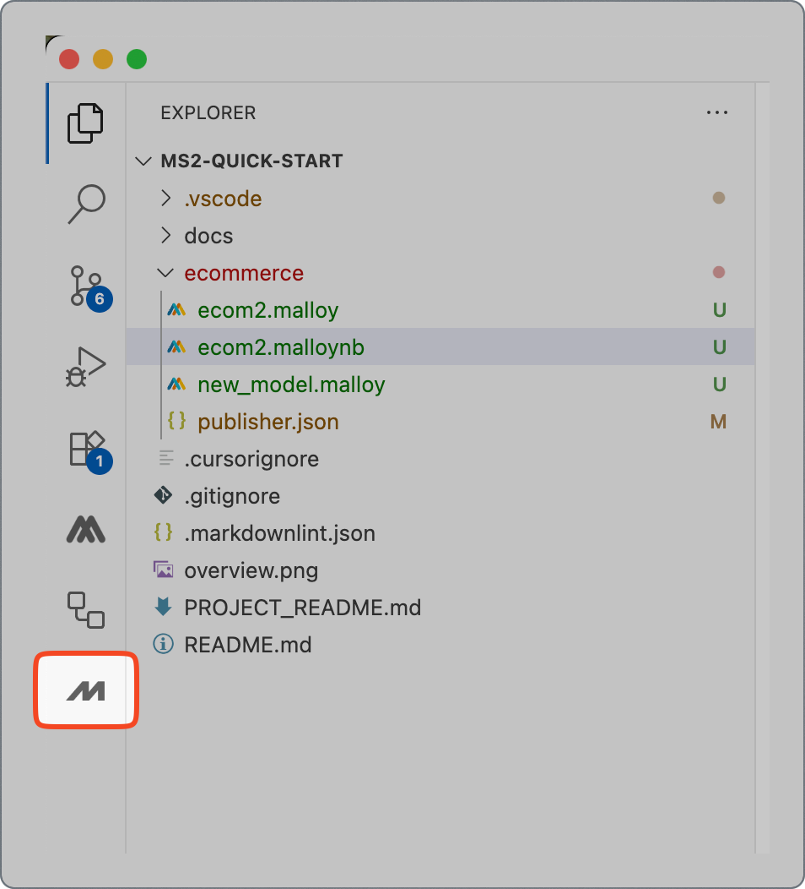
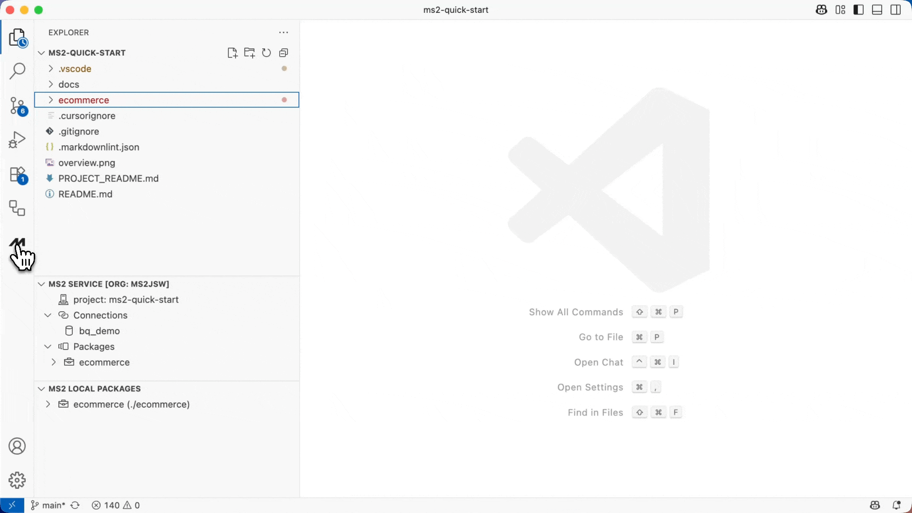
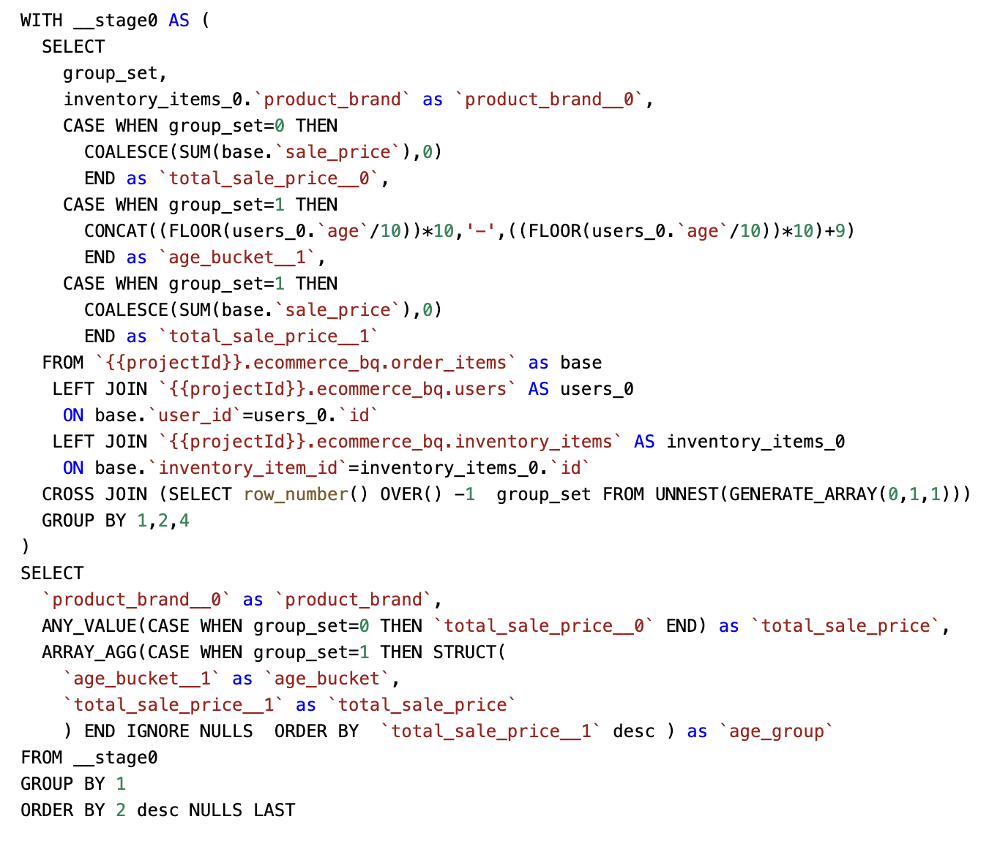
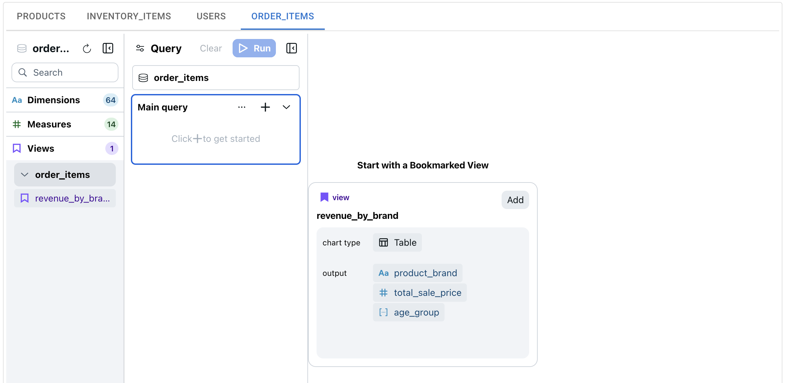
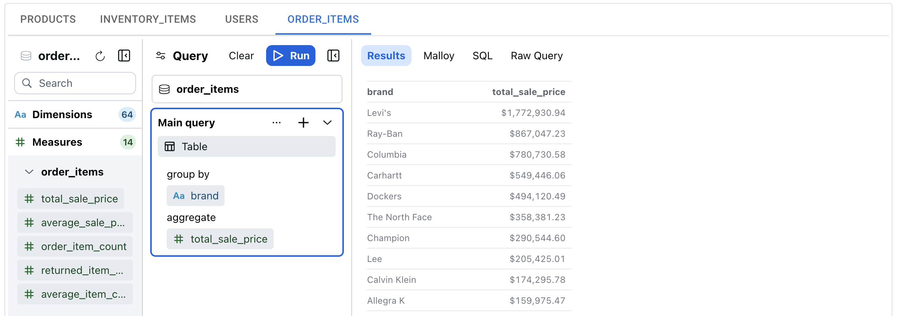

# MS2 Quick Start

Welcome to **MS2**, your AI-powered, open-source based, semantic data platform. MS2 helps you transform raw operational data into clean, governed, and reusable semantic models — and then puts those models to work across a wide range of modern data experiences.

At the core of MS2 is [**Malloy**](https://malloydata.dev), an open-source semantic modeling language designed for composability, auditability, and clarity. Malloy models are portable and can run anywhere — and MS2 extends this philosophy with an open, API-driven runtime based on the open-source **Malloy Publisher**. That means no vendor lock-in: you can build locally, host on your own infrastructure, or use our managed service — the choice is yours.

Once a semantic model is published, the MS2 platform makes it usable everywhere, powering a wide range of modern data experiences:

- **AI agents** with contextual, trusted data via the Model Context Protocol (MCP) server
- **Natural language notebooks** for ad hoc exploration
- **Embedded data apps** built with the open-source Malloy Publisher SDK
- **BI dashboards** through our SQL interface (coming soon)


No matter how your team works — in notebooks, apps, dashboards, or chat — MS2 ensures you're always working from the same semantic foundation, built on open standards and ready for the future.

## What's in this Quick Start?
This Quick Start guides you through the end-to-end MS2 workflow, focusing on a familiar and powerful pattern: a **data modeler** defines trusted business logic in VS Code using our AI Copilot, and a **data analyst** explores the governed data model using Malloy's no-code Explorer query builder. This mirrors the proven modeler → analyst workflow popularized by tools like DBT and Looker — now reimagined for the AI era, and freed from closed systems.

You will learn how to:
1. [**Build a semantic model**](#step-1-build-a-semantic-model-with-the-ms2-ai-copilot) using the MS2 AI Copilot in VS Code.
2. [**Create a view**](#step-2-create-a-view) to validate and iterate on your model.
3. [**Publish your work**](#step-3-publish-to-the-ms2-service) to the MS2 service for broader use.
4. [**Explore your semantic model**](#step-4-explore-your-semantic-model) using the no-code Explorer to answer business questions.

> [!NOTE]
> **What is a semantic model?** Raw data in SQL or data warehouses needs to be refined to be useful. A semantic model describes your data in business terms, defining the joins, dimensions, measures, and views used to query the data. It includes the business logic that makes raw data useful — ensuring that instead of 5 different analysts writing slightly different queries to compute "revenue," there's one trusted definition that everyone can use.

## Step 0: Get Set Up

Before you can build a semantic model, you'll need to set up your environment.

#### Prerequisites

Before starting, make sure:

- A **MS2 admin has set up your organization** on the service. (self-service demo coming soon)
- You have a basic understanding of **Malloy**, the semantic modeling language MS2 is built on. [View Malloy Docs →](https://docs.malloydata.dev/documentation/)

#### Clone the Quick Start Package & Open in VS Code

```bash
git clone https://github.com/ms2data/ms2-quick-start.git
cd ms2-quick-start
code .
```

#### Install the MS2 VS Code Extension

1. In VS Code, go to the Extensions view (`Cmd+Shift+X`).
2. Search for `MS2` and install the extension.
3. _(Temporary)_ Find the installed Malloy extension and select **"Switch to Pre-Release Version."**

> [!WARNING]
> The VS Code AI Copilot extension mostly works in Cursor, but it hasn't been fully tested—some features may be limited.

#### Log In to MS2 Service

1. In the VS Code Explorer sidebar, expand **"MS2 Service."**
2. Click **"Sign In."**
3. Click **"+ Add new organization"** and enter the name provided by your MS2 admin.
4. Complete the login flow in your browser by authenticating with you email or Google account.
5. When redirected back to VS Code, select the project: `ms2-quick-start`.


The VS Code Service Panel is where you can view your organization's projects, connections, and packages in the MS2 service. For example:


In the `ms2-quick-start` project, you can see you have access to a "bq_demo" connection. The connection is managed by the MS2 service and is not stored locally, but the MS2 VS code extension will discover it in your project and allow you to use it in your local models -- thus eliminating the need to store database credentials locally. The `ms2-quick-start` project has a single package `ecommerce` and a single version has been published (0.0.0)

## Step 1: Build a Semantic Model with the MS2 AI Copilot

At the core of MS2 is the **semantic model**—a governed, versioned interface that defines how your data should be understood and used. Think of it as a **an API for your data**: it captures not just structure, but business meaning. You'll use the **MS2 AI Copilot in VS Code** to generate your first model using existing catalog metadata, query logs, and the structure of your data warehouse.

#### Open & Arrange the MS2 Chat Panel

1. Open the MS2 Chat Panel. You will initially see it on the left in Activity Bar. To open the AI Copilot chat, click on the `M`, as shown in the screenshot below.



2. In order to view both the File Explorer, the MS2 Service Panel and the Chat (along with your file), we recommend moving the chat over to the right panel by dragging and dropping the MS2 Chat into a panel on the right, as shown in the screencast below:



#### Generate Your Semantic Model with the MS2 AI Copilot

1. Create a new .malloy file in the ecommerce folder, then open the MS2 chat and ask the Agent to help you build a model on the ecommerce dataset. For example, you might enter: _Build a semantic model of our ecommerce data to analyze sales by brand_. 


2. The Agent will walk you through the process of building a Malloy semantic model - asking clarify questions at key steps along the process. You may have to review the AI agent's recommendations and confirm to ensure that the model meets your needs: 


3. After the model is generated, you can review Approve the edit to move the model into a malloy file. 

The ecommerce data set has four tables -- `orders_items`, `users`, `products`, and `inventory_items`.  You should see Malloy sources for each of these tables.  The `orders_items` table should have join relationship to the `users` and `inventory_items` tables.  And the `inventory_items` table should have a join relationship to the `products` table.

Each source should have a set of dimensions and measures defined, along with annotations that describe the different entities and type information (e.g., currency, percent, duration). For more information on how Malloy dimensions, measures, joins, views, etc. work, see the [Malloy documentation →](https://malloydata.dev/documentation)

> [!NOTE]
> In this example, we are using a sample ecommerce data set.  The ecommerce data set is a sample data set that is included with the Malloy samples.  Our copilot only has access to the table schema to generate the model.  In a real-world scenario, you can add more context to the copilot by connecting to or uploading additional metadata such as:
> - Catalog metadata
> - Query logs
> - Business glossary

#### Review Your Model
Your generated model is a strong starting point, but it's important to review it for accuracy and completeness. Specifically, you should:
- **Confirm the structure**: Ensure the model includes the four tables described above (`orders_items`, `users`, `products`, and `inventory_items`) and that the join relationships are correct.
- **Check the details**: Verify that the expected dimensions and measures have been defined for each source.
- **Think ahead**: Consider the types of questions you or your team will want to ask. While there is no single "right" model, a good model is one that can answer your anticipated analytical questions.


#### Adjust Your Model
Once you've reviewed the model, you'll likely want to make adjustments. You can edit `.malloy` files manually, or you can use the MS2 AI Copilot. The easiest way is to instruct the copilot directly: highlight a block of Malloy code (like a measure or dimension), press `Ctrl+Cmd+I` to open the prompt, and describe the change you want in natural language (e.g., _"make the age dimension an age range string such as 10-19"_).

> [!TIP]
> The more accurate and complete your semantic model, the better your downstream analysis and AI performance. Describe your data in detail and use the copilot to help you.

## Step 2: Create a View

Creating views is a powerful way to validate your semantic model and define reusable analyses. For this, we can use the AI Copilot's **autocomplete** feature. As you start typing, the AI will suggest code to complete your thought.

> [!NOTE]
> If you have other AI copilot extensions enabled (like GitHub Copilot), you may need to disable them to ensure that the MS2 Copilot's autocomplete functionality works correctly.

Let's create a simple view to calculate sales by brand - a good jumping off point for analysts or other downstream consumers of the data.

#### Step-by-Step Instructions:

1. **Find the `order_items` source** in your `ecommerce.malloy`
2. **Below the dimensions and measures**, start typing `view: sales_by_brand `  and pause (be sure to include a space after brand to trigger the copilot)
3. **Wait for the copilot suggestion** - it should suggest a complete view definition with a measure for total sales by brand. Adjust as desired & resolve any errors
4. **Add a `# bar_chart` tag** above the view to make it display as a bar chart
5. **Click "Run"** above the view execute the query. Results will display on the right

These steps are demonstrated in the following screencast:


Let's try a more complex query. First, move the `# bar_chart` tag below  `aggregate: total_sales` - this will change the `sales_by_brand` to a table, which is better to display a nested query for each table row.  Below this tag, type something like `nest: age_bucket ` and wait a couple seconds.  The **MS2 AI Copilot** should autogenerate a nested view with a measure for the total sales by age group.  When you run this query, you should see sales broken down by brand, and within each brand, sales broken down by age group similar to the following:


While this type of nested view might look simple, it's very difficult to create in most modern data tools. For example, clicking on the **SQL** tab in the results panel will show the SQL that was used to generate the results. This SQL is not easy to write (especially for an LLM) and is prone to errors. And if you want to change the query, you would have to write and validate the SQL manually.



#### Troubleshooting
If you're having trouble with the autocomplete feature, here are a few things to try:
- **Ensure you've typed a `space` or `Tab`** after the start of your code (e.g., after `view: sales_by_brand`).
- **Wait 2-3 seconds** for the suggestion to appear. The service latency is not yet optimized, so it can sometimes take a moment.
- **Disable other AI copilots.** If you use tools like GitHub Copilot, they may provide conflicting suggestions. Try disabling them for this workspace.
- **Start with valid Malloy.** Autocomplete works best when it has a valid starting point, such as `view: `
- **This feature is new and a work in progress.** We are actively working to improve it - Please share any feedback you have!

## Step 3: Publish to the MS2 Service

Publishing makes your semantic model and analysis available across the platform — ready to serve AI agents, applications, dashboards, and notebooks. The MS2 service uses standard software package management conventions to provide data governance and versioning for your semantic models and notebooks.

For publishing, we will use the MS2 extension's "Local Packages" panel. The Local Packages panel is where you can view and manage the local packages in your workspace. For example:


If you have the `ecommerce` package open locally, you should see a single version `0.0.0`. This is the version in the package's local `publisher.json` file. `publisher.json` is a file package manifest file that contains the package's name, version, description, and other metadata. To publish a new version of the package, we will need to update the version in the `publisher.json` file.

#### Update the Package Version

1. Open the `publisher.json` file in your workspace.
2. Set the version to `0.0.1`:

```json
{
  "name": "ecommerce",
  "version": "0.0.1",
  ...
}
```

#### Publish from VS Code

1. In the Explorer panel, expand **"MS2 Local Packages."**
2. You should see the package `ecommerce`.
3. Click the **"Publish"** button.
4. When prompted, click **"Yes"** to confirm.

> [!NOTE]
> You can also publish packages from the command line using the [MS2 CLI →](docs/cli.md)

#### Confirm Successful Publication

1. In the Explorer panel, expand **"MS2 Service."**
2. Click the **Refresh** icon (🔄).
3. Expand: `Packages` > `ecommerce`
4. You should now see version `0.0.1` listed under the package.

#### Publish Package Screencast
Here's a screencast of the publish process, showing all the steps:


## Voila!

Your semantic model is now:

- **Governed** and version controlled
- **Discoverable** and queryable via APIs and notebooks
- **Ready** for use by analysts, embedded apps, dashboards, or AI agents


## Step 4: Explore your Semantic Model

Now that you've published your semantic model to the MS2 platform, it's time to explore and extend it using Malloy's **Publisher + Explorer** no-code interface.

This is where your work as a data modeler becomes a launchpad for analysts, product managers, and other data consumers to ask meaningful questions — without writing a single line of SQL.

## Open Publisher → Explorer

Let's open the Explorer interface to explore your semantic model.

1. **Open your browser** and navigate to: `https://<your-org>.data.ms2.co/ms2-quick-start`
2. **Log in** to your MS2 account
3. **Select the `ms2-quick-start` project** from your organization's project list
4. **Click the `ecommerce` package** you just published to open its detailed view
5. **Navigate to the Models panel** and click `ecommerce.malloy` — the model file you authored in VS Code
6. **Select the `order_items` source tab** to focus on the main fact table

The complete navigation process is shown in this screencast:


## Understand the Explorer Layout

The Explorer interface has three panels:

- **Source Panel (Left)**: Browse your semantic model — dimensions, measures, views — grouped by source.
- **Query Panel (Middle)**: Construct and refine your queries.
- **Results Panel (Right)**: See your live results and inspect the generated Malloy or SQL.

At the top, you'll see your available sources — `order_items`, `users`, `products`, `inventory_items` — created earlier in your Malloy model. Note that some of the source, dimension, and measure names in this quick start guide may be different from the names in your model. Select the `order_items` source tab, which is built around the ecommerce dataset's main fact table.



Let's walk through a real example.

## Load and Run a Saved View

1. Make sure you are on the `order_items` source tab.
2. In the **Views** section of the Source Panel, you should see the `sales_by_brand` view you created in VS Code.
3. Click it. The Query Panel should populate with your saved query.
4. Click **Run**.


✅ You should see the exact same result in the Results Panel that you saw earlier in VS Code.


## Create a Nested Query in Explorer

Now let's recreate the same view we created in VS Code — from scratch — using just clicks.

1. In the Query Panel, click **Clear** to start fresh.
2. In the Source Panel:
   - Open dimensions and scroll down to the products source. You'll see products is joined with order_items, which allows us to group by brand. Expand the `products` source.
   - Hover over `brand` and select **Add as Group By**.
   - Open Measures and scroll down to the `total_sales` measure in the `order_items` source.
   - Hover over `total_sales` and select **Add as Aggregate**.

3. The Query Panel now shows these fields.
   Click **Run** — and you'll see revenue by brand in the Results Panel.

   

4. Now, click the **+** button at the top of the Main Query panel and select **Add blank nested query**.

5. In the nested query block that appears, click the **+** button inside of the nested query and:
   - Add a Group By and select `user_age_group`
   - Add an Aggregate and select `total_sales`
   - Select `Bar` for the chart type
   - Click **Run**.

   

✅ You've just created a **nested query** that breaks down sales by brand and age group — the same query you wrote earlier in code — now in just a few clicks.

To learn more about the Explorer, see the [Publisher → Explorer Documentation →](https://github.com/malloydata/publisher?tab=readme-ov-file#ad-hoc-data-analysis)

## Reflect on What You Just Did

Let's pause and appreciate what just happened:

- You **built a semantic model** using Malloy and the MS2 AI Copilot.
- You created a view in **VS Code** with nested logic that most SQL experts would struggle to write.
- Then, using that same model, you **recreated the same analysis in Explorer** with a few clicks — enabling anyone on your team to generate complex insights from a trusted, governed model.

This is the power of MS2:

- Developers and analysts working together, on the same foundation.
- Code and no-code experiences that reinforce each other.
- A single semantic model, used across tools and personas — AI, dashboards, apps, and more.

---

<br>

# Other Data Consumer Experiences

MS2 offers multiple, role-tailored ways to consume your semantic models. Pick the path (or paths) that suit your target roles and goals best — and build from a single source of truth. Click on the options below to continue.

## Notebook-based Dashboards

👥 **Target Persona:** Technical stakeholders who want reproducibility and transparency

✅ **Great for:** Shareable, code-first, live dashboards on your semantic models.

[📖 Publisher → Notebook-based Dashboards →](https://github.com/malloydata/publisher?tab=readme-ov-file#notebook-based-dashboards--data-stories)

## Embedded Data Apps (Publisher SDK)

👥 **Target Persona:** Software engineers building data driven apps

✅ **Great for:** Building internal tools, customer facing dashboards, or any UI that needs trustworthy data experiences.

[📖 Publisher → Embedded Data Apps →](https://github.com/malloydata/publisher?tab=readme-ov-file#embedded-data-applications)

## AI Agents (Model Context Protocol)

👥 **Target Persona:** Analysts and engineers using tools like Claude, Cursor, or custom agents

✅ **Great for:** Trustworthy AI copilots, guided analysis, conversational analytics, and embedded intelligence.

[📖 Publisher → AI Agents →](https://github.com/malloydata/publisher?tab=readme-ov-file#mcp-based-ai-data-agents)

## Legacy Dashboards (SQL Interface)

👥 **Target Persona:** Analysts using Tableau, Power BI, Looker, Superset, Metabase, etc.

✅ **Great for:** Semantic consistency in legacy dashboards, reduced maintenance and duplication of logic, and a bridge from existing BI tools into the semantic layer.

[📖 Publisher → BI Dashboards →](https://github.com/malloydata/publisher?tab=readme-ov-file#legacy-bi-tools-coming-soon)

### More Consumer Experiences Coming Soon...

---

<br>

# Administration

While this Quick Start focused on the core workflow of building and exploring a semantic model, the MS2 platform is a globally distributed system designed to scale with your organization — across environments, teams, and regions.

This gives you:

- **100× the scale**, **10× the availability**, and **1/10th the cost** compared to BI tools and state of the art semantic layers
- **Enterprise-grade controls** like governed metrics, fine-grained ACLs, versioning, audit logs, and usage telemetry

MS2 provides powerful administration tools to help you manage your semantic resources and deployment workflows with confidence and control.

## Versioning & Deployment

While MS2 is flexible, we recommend integrating it with standard software development practices for robust, scalable deployments. The following outlines our best-practice approach.

1.  **Source Control** (e.g., Git) for tracking code changes.
2.  **Package Registry** for managing published, versioned semantic models.

### Recommended Workflow

A typical workflow integrates your existing tools:
1.  **Develop:** Use source control like Git to manage model changes.
2.  **Publish:** Use a CI/CD pipeline (e.g., GitHub Actions) to automatically publish versioned packages to the MS2 registry upon merging.
3.  **Deploy:** Manage deployment across environments (dev, staging, prod) using Infrastructure as Code (IaC) tools like Terraform.

### Consumption & Compatibility

By default, consuming applications will use the **'latest'** version of a semantic model. However, any downstream tool can pin to a specific version number. This ensures that changes to the model won't break existing dashboards, AI agents, or embedded applications.

This versioning system enables robust deployment patterns like A/B testing, blue-green deployments, and instant rollbacks, giving you full control over your data assets.

## MS2 Admin Portal

The **Admin Portal** is a browser-based interface for managing your organization's semantic models.

🔗 Open the Admin Portal:  
`https://<your-org>.admin.ms2.co/ms2-quick-start`

From the portal, you can:

- Navigate across **organizations**, **projects**, and **packages**
- Manage permissions and access roles
- View and promote package versions
- Configure database connections for different environments (e.g., dev, staging, prod)

To learn more, see the [Admin Portal Guide →](docs/portal.md)

## MS2 CLI

For advanced users and DevOps teams, the **MS2 CLI** offers full control over your semantic layer via the command line — ideal for automation, CI/CD, and scripting.

With the CLI, you can:

- Manage projects, packages, and connections
- Publish and promote versions
- Automate semantic model deployments

To learn more, see the [MS2 CLI Guide →](docs/cli.md)

With MS2's robust admin tools, you can confidently govern semantic models across environments — and power data experiences at scale.

---

<br>

# What's Next?

Choose the consumption path(s) that match your workflow and:

- Start building semantic powered applications
- Share notebooks with stakeholders
- Connect AI agents to drive smart, explainable automation
- Prepare to unify dashboards via the upcoming SQL interface

