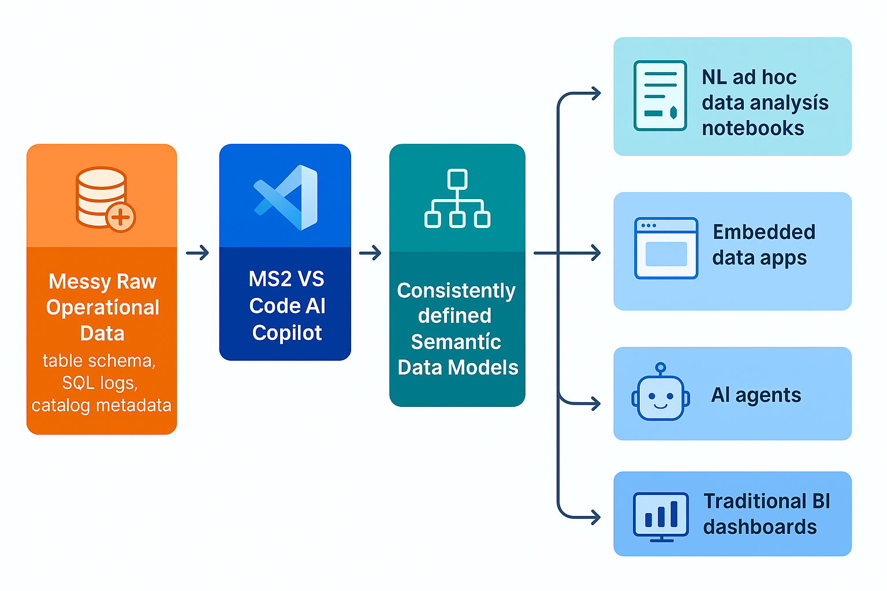

# MS2 Quick Start

Welcome to **MS2**, your AI-powered semantic data platform. MS2 transforms the chaos of raw operational data into clean, governed, and AI-ready semantic models — and then makes those models usable everywhere. Whether you're a developer, analyst, product manager, or AI engineer, you work from the same shared foundation.

## Here’s how it works

Using our VS Code **AI Copilot**, you generate rich, structured semantic models that define your business concepts, metrics, and relationships with precision. Our AI Copilot uses your operational tables, SQL logs, and catalog metadata to generate rich semantic models quickly and accurately.

From there, your models become the foundation for a variety of trusted data experiences such as --
_Natural Language Notebooks for ad hoc exploration, Embedded Data Apps, AI Agents powered by semantic understanding, and BI Dashboards (via a SQL interface)._



This Quick Start Guide will walk you through building your first semantic model, publishing it, and choosing how you want to put it to work — based on your target roles and your goals.

# Semantic Modeling Workflow

MS2 helps you create, govern, and use semantic models of your business data — quickly and at scale. In this section, you’ll:

1. Build a semantic model using the MS2 AI Copilot
2. Analyze data using Malloy notebooks
3. Publish your models and analyses to the platform

## Step 1: Build a Semantic Model with an AI Copilot

At the core of MS2 is the **semantic model**—a governed, versioned interface that defines how your data should be understood and used. Think of it as a **semantic API**: it captures not just structure, but business meaning. You’ll use the **MS2 AI Copilot in VS Code** to generate your first model using existing catalog metadata, query logs, and the structure of your data warehouse.

### Prerequisites

Before starting, make sure:

- A **MS2 admin has set up your organization** on the platform.
- You have a basic understanding of **Malloy**, the semantic modeling language MS2 is built on. [📖 View Malloy Docs →](https://malloydata.dev)

### Clone the Quick Start Package

```bash
git clone https://github.com/ms2data/ms2-quick-start.git
cd ms2-quick-start
code .
```

### Install the MS2 VS Code Extension

1. Open VS Code.
2. Go to the Extensions view (`Cmd+Shift+X`).
3. Search for `MS2` and install the extension.
4. _(Temporary)_ Find the installed Malloy extension and select **“Switch to Pre-Release Version.”**

> Note: The VS Code AI Copilot extension mostly works in Cursor, but it hasn't been fully tested—some features may be limited.

### Log In to MS2

1. In the VS Code Explorer sidebar, expand **“MS2 Service.”**
2. Click **“Sign In.”**
3. Click **“+ Add new organization”** and enter the name provided by your MS2 admin.
4. Complete the login flow in your browser (email or Google account).
5. When redirected back to VS Code, select the project: `ms2-quick-start`.

> ✅ Make sure you log in with the same email address your MS2 admin used to set up your access.

> TODO: Add a screenshot when the service is back online. Describe what logging in does. Discover connections, etc. so you don't have to have local database credentials.

### Generate Your Semantic Model

1. In the file view, create a new file: `ecommerce.malloy`
2. Open the Command Palette (`Cmd+Shift+P`) and run: **MS2: Suggest Semantic Model**
3. When prompted, enter a high-level prompt. For example: _Build a model of ecommerce data that makes it easy to analyze sales trends across different dimensions._

The copilot will generate a Malloy model with:

- Dimensions, measures, joins
- Common views and reusable queries
- Descriptions and documentation

> ⚠️ Please note MS2 is an early-stage product and the copilot is not yet fully trained. We expect to make substantial improvements to the copilot in the coming months. If any syntax errors remain, fix them manually before proceeding.

### Review & Adjust

Your generated model is a strong starting point — but real-world accuracy matters. You can:

- Manually edit `.malloy` files
- Accept inline suggestions from the MS2 extension
- Press `Ctrl+Cmd+I` to open the prompt window and generate or modify code with natural language instructions

> 💡 The more accurate and complete your semantic model, the better your downstream analysis and AI performance. Describe your data in detail and use the copilot to help you.

## Step 2: Create a Notebook Analysis with an AI Copilot

Notebooks in MS2 combine the structure of a dashboard with the flexibility of a document. They’re governed, versioned, and powered by your semantic models.

### Create a New Notebook

1. Create a new file called: `sales_performance.malloynb`
2. Open the Command Palette (`Cmd+Shift+P`) and run: **MS2: Suggest Analysis Topics**
3. Enter a notebook description such as: _Explore product sales performance across various dimensions like product category, brand, distribution method, etc._

MS2 will insert a sequence of structured analysis blocks—each one describing a business question to explore.

### Generate Malloy Queries

For each analysis block:

1. Refine the text description to reflect what you want to analyze.
2. In the MS2 toolbar of the code cell, click **“Generate.”**
3. Wait ~10–15 seconds. A Malloy query tailored to the prompt will appear.

> 💡 You’re now describing data questions in plain English and letting the system handle the query writing.

### Run and Review

1. Check for errors in the generated code and fix if needed.
2. Click **“Run”** above the block to execute the query.
3. View your results as interactive tables or charts.

Repeat across the notebook to build a complete, presentation-ready analysis.

## Step 3: Publish to the MS2 Data Platform

Publishing makes your semantic model and analysis available across the platform—ready to serve AI agents, applications, dashboards, and notebooks.

> TODO: Add a screenshot of the MS2 local package management panel when the serivce is back online.

### Update the Package Version

1. Open the `publisher.json` file in your workspace.
2. Set the version to `0.0.1`:

```json
{
  "name": "ms2-quick-start",
  "version": "0.0.1",
  ...
}
```

### Publish from VS Code

1. In the Explorer panel, expand **“MS2 Local Packages.”**
2. You should see the package `ms2-quick-start`.
3. Click the **“Publish”** button.
4. When prompted, click **“Yes”** to confirm.

> 📡 This publishes your semantic model and notebooks to the MS2 platform under your organization and project.

### Confirm Successful Publication

1. In the Explorer panel, expand **“MS2 Service.”**
2. Click the **Refresh** icon (🔄).
3. Expand:`Packages` > `ms2-quick-start`
4. You should now see version `0.0.1` listed under the package.

> ✅ This confirms your semantic package is successfully published and available on the platform.

### Voila!

Your semantic model and analysis notebook are now:

- **Governed** and version-controlled
- **Discoverable** and queryable via APIs and notebooks
- **Ready** for use in embedded apps, dashboards, or AI agents

<br>

# Data Consumer Experiences

Now that your semantic models and notebooks are published, it’s time to put them to work.

Most data tools are built with a single persona in mind: the analyst, the engineer, the business user. That leads to fragmented workflows, mismatched definitions, and yet another silo in the stack. **MS2 is different.**

MS2 is a **semantic data platform** — designed to unify how your organization defines, governs, and uses data, across different roles, teams, and tools. Whether you're writing code, building apps, exploring data, or enabling AI, you work from the **same shared semantic foundation**.

MS2 offers multiple, role-tailored ways to consume your semantic models. Pick the path (or paths) that suit your target roles and goals best — and build from a single source of truth. Click on the options below to continue.

## Natural Language Notebooks (No-Code + AI UX)

👥 **Target Persona:** Business analysts, product managers, less-technical users

✅ **Great for:** ad hoc reporting, fast insights, and sharing lightweight dashboards.

[📖 Goto Natural Language Notebooks →](READMEs/nl-notebooks.md)

## Embedded Data Apps (React SDK)

👥 **Target Persona:** Software engineers building data-driven apps

✅ **Great for:** Building internal tools, customer-facing dashboards, or any UI that needs trustworthy data experiences.

[📖 Goto Embedded Data Apps →](READMEs/embedded-data-apps.md)

## AI Agents (Model Context Protocol)

👥 **Target Persona:** Analysts and engineers using tools like Claude, Cursor, or custom agents

✅ **Great for:** Trustworthy AI copilots, conversational analytics, and embedded intelligence.

[📖 Goto AI Agents →](READMEs/ai-agents.md)

## Traditional Dashboards (SQL Interface)

👥 **Target Persona:** Analysts using Looker, Tableau, Power BI, Metabase, etc.

✅ **Great for:** Semantic consistency in legacy dashboards, reduced maintenance and duplication of logic, and a bridge from existing BI tools into the semantic layer.

[📖 Goto Traditional Dashboards →](READMEs/traditional-dashboards.md)

## More Consumer Experiences Coming Soon...

<br>

# What’s Next?

Choose the consumption path(s) that match your workflow and:

- Start building semantic-powered applications
- Share notebooks with stakeholders
- Connect AI agents to drive smart, explainable automation
- Prepare to unify dashboards via the upcoming SQL interface

When you're ready to go deeper:

- 📖 [Explore the MS2 Admin Portal & CLI](READMEs/admin-portal.md)
- 🗺️ [Explore Malloy Samples in MS2](READMEs/exploring-malloy-samples.md)

- 🤝 [Request a Personalized Walkthrough](#)
