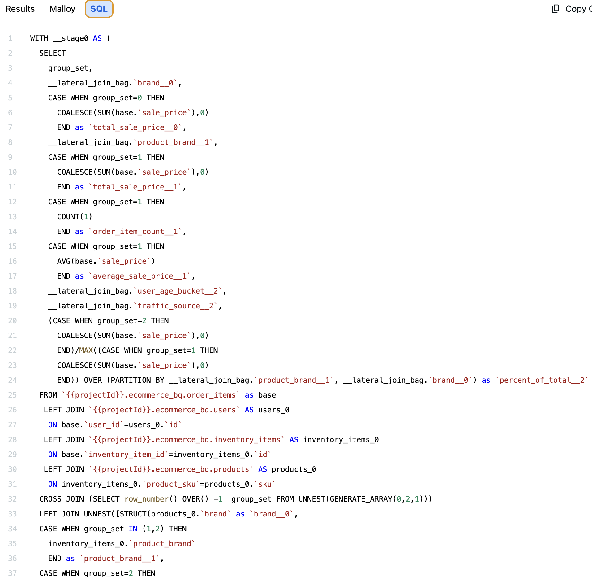

# 📊 Malloy Explorer: Visual Query Builder for Malloy

## 1. Introduction

**Malloy Explorer** is a no-code, visual query builder built on top of the [Malloy](https://malloydata.dev) semantic modeling language. It provides a seamless interface for exploring data, analyzing key business metrics, and building reusable queries — all without writing code. Under the hood, every action in the Explorer generates valid Malloy, ensuring semantic consistency, auditability, and AI-readiness.

Designed for data consumers and developers alike, Malloy Explorer brings the power of governed semantic models to a modern, interactive user experience. It empowers users to ask complex questions, segment and visualize results, and drill into nested structures — all from a single interface.

### Key Benefits

- **Semantic-first foundation** – Every query runs against a Malloy model, capturing business logic and relationships.
- **No-code UX** – Construct queries visually using dimensions, measures, filters, and charts.
- **Live, nested analysis** – Easily drill down into rich multi-level breakdowns using Malloy's native nesting capabilities.
- **Full transparency** – Instantly view the Malloy and SQL generated by your visual query.
- **AI and developer ready** – Output is valid Malloy code, making it composable, reusable, and LLM-consumable.

### Interface Overview

Malloy Explorer is organized into three main panels:
1. **Source Panel** – Browse available fields, measures, and saved views from the semantic model.
2. **Query Panel** – Assemble and refine your query using a clean visual editor.
3. **Results Panel** – View results as tables or charts, and inspect the underlying Malloy and SQL.

---

## 2. Source Panel

The **Source Panel** is where exploration begins. It presents the structure of the selected Malloy model — typically organized around a central transactional or fact table — and surfaces all the fields and reusable logic available for analysis.

The panel is organized into three sections:
- **Dimensions** – Attributes you can group by, filter on, or sort with.
- **Measures** – Predefined aggregated metrics.
- **Views** – Saved queries or perspectives authored in the model.

Any field or view selected here will immediately appear in the **Query Panel**, ready to run or modify.

### Dimensions

The **Dimensions** section lists descriptive fields — such as IDs, dates, categories, and derived attributes — from both the primary model and any joined sources.

Dimensions are grouped by their source. For example, in a query centered around `order_items`, you might also see dimensions from joined models like `users`, `inventory_items`, or `products`.

Hovering over a dimension reveals contextual actions:
- **Add as Group By** – Segment the result by this dimension.
- **Add as Filter** – Apply a filter based on the field.
- **Add as Sort** – Sort the result set by this value.

### Measures

The **Measures** section contains all aggregated metrics available in the current model. These are grouped by source and include calculations such as totals, averages, counts, and ratios.

Hovering over a measure provides the following actions:
- **Add as Aggregate** – Include the metric in the result set.
- **Add as Filter** – Use the measure to restrict the result set.
- **Add as Sort** – Sort results based on the metric value.

#### Symmetric Aggregates

Malloy supports **symmetric aggregates**, ensuring that metrics compute correctly even across joins with varying cardinality. This eliminates common errors found in traditional SQL-based tools and guarantees reliable, reusable aggregations.

Learn more: [Understanding symmetric aggregates](https://cloud.google.com/looker/docs/best-practices/understanding-symmetric-aggregates)

### Views

The **Views** section surfaces saved queries defined in the underlying Malloy model. These views often represent curated KPIs, commonly-used explorations, or analytical building blocks.

Clicking a view loads its full query into the **Query Panel**, where it can be run, modified, or used as a base for deeper exploration.

---

## 3. Query Panel

The **Query Panel** is where queries come together. It provides a structured, visual representation of your query — and supports far more than basic field selection.

### Top Controls

- **Run Button** – Executes the query and displays the result.
- **Clear Button** – Removes the current query configuration.
- **More Actions Menu (`...`)** – Includes:
  - **Clear Query**
  - **Nest Query** (used to add subqueries — see below)

### Add Query Element (`+`)

This menu allows you to add fields and logic by *operation*, rather than by data source. Categories include:

- **Add Group By**
- **Add Aggregate**
- **Add Filter**
- **Add View**
- **Add Limit**
- **Order By**
- **Add Blank Nested Query**

### Display Format Selector

Choose how to visualize your results. Available formats include:

- Table
- Bar Chart
- Line Chart
- JSON
- List / List Detail
- Dashboard
- Point Map
- Scatter Chart
- Segment Map

### Query Configuration

Your current query is displayed using clearly labeled sections:

- **Group By**
- **Aggregate**
- **Filter By**
- **Order By**
- **Limit**

Each section reflects the logic of your query and is fully editable.

---

### Nested Queries

Malloy's **nesting** feature enables rich, multidimensional analysis — and the Explorer gives you a no-code way to use it.

To add a nested query:
- Open the **More Actions** menu
- Select **Nest Query**

Each nested block can have its own groupings, filters, measures, and even additional nests.

Use nesting to:
- Break down results by subgroups
- Create expandable subtables or charts
- Explore deep, layered data relationships

> Malloy compiles nested blocks into safe, aggregating subqueries in SQL. Filters can be scoped to any level.

Reference: [Malloy Nested Views Documentation](https://malloydata.dev/docs/nested-views)

---

## 4. Results Panel

The **Results Panel** displays your query output whenever you click **Run**. Results are rendered according to your selected chart type and include support for nested results.

### Visual Output

Choose from a range of formats, including:
- Tables
- Bar, Line, and Scatter Charts
- Maps
- Lists
- Dashboards
- JSON

Nested queries produce expandable subtables or inline charts that show multidimensional breakdowns per row.

### Code Transparency

Alongside visual output, the Results Panel includes:
- **Malloy Tab** – Shows the Malloy query generated by your visual configuration.
- **SQL Tab** – Displays the fully compiled SQL sent to the database.

This transparency gives developers, analysts, and AI systems full access to inspect, reproduce, or extend any query.

---

## Summary

Malloy Explorer brings together semantic modeling and visual analytics in a single, ergonomic interface. It offers:

- A governed foundation for consistent metrics
- A no-code interface for intuitive exploration
- Deep analytical power through nesting
- Transparent, portable output for trust and reuse

With Malloy Explorer, everyone can ask better questions — and trust the answers.
